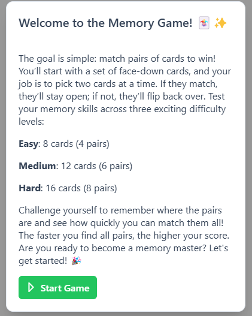
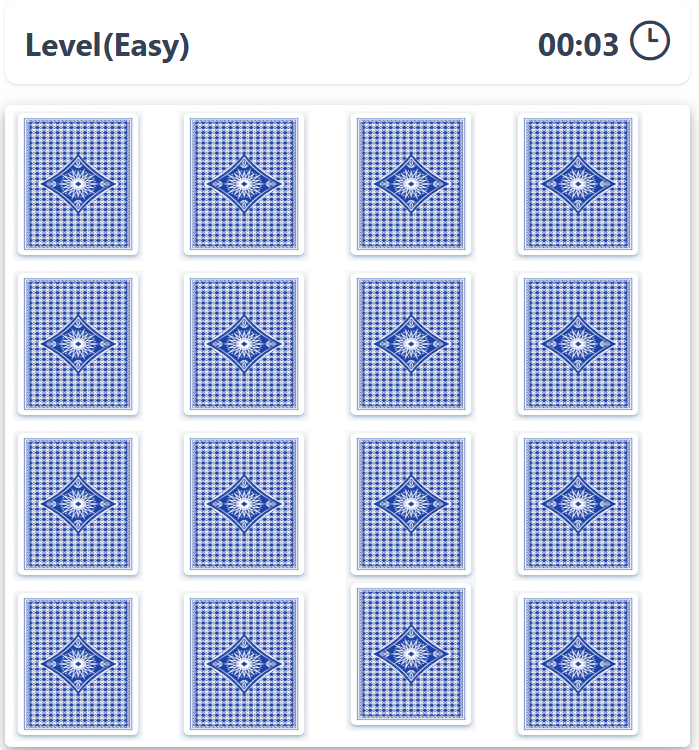

# Mind Game - Memory Card Game

This is a simple memory card game built using Angular (version 19.2.0) and PrimeNG (version 19.0.10). The game offers three different difficulty levels: Easy, Medium, and Hard. Players are required to match pairs of cards within a certain number of attempts.

## Game Overview

The objective of the game is to find pairs of matching cards. Depending on the difficulty level, the player will need to select a specific number of pairs:

- **Easy Level:** Select a pair of 8 cards (4 pairs).
- **Medium Level:** Select a pair of 12 cards (6 pairs).
- **Hard Level:** Select a pair of 16 cards (8 pairs).

The game will shuffle the cards and hide them. The player needs to select cards in pairs and try to match them. The game ends when all pairs are matched.

## Features

- Three difficulty levels: Easy, Medium, and Hard.
- Uses Angular (19.2.0) for frontend logic.
- PrimeNG (19.0.10) for UI components.

## Getting Started

### Prerequisites

Make sure you have the following installed:

- Node.js (recommended version: v22.14.0 or later)
- npm (Node Package Manager) version 11.2.0
- Angular CLI Version 19.2.5

### Installation & Running the application

1. Clone the repository:
   ```bash
   git clone https://github.com/ArjunRajaK/Miind-Card-Game.git
   ```
2. ```
   cd Miind-Card-Game
   ```
3. ```
   npm install
   ```
4. ```
   ng serve
   ```
5. ```
   ng test for testing
   ```
   Open your browser and go to http://localhost:4200 to start playing the game.

### Screen shots

- 

- 
